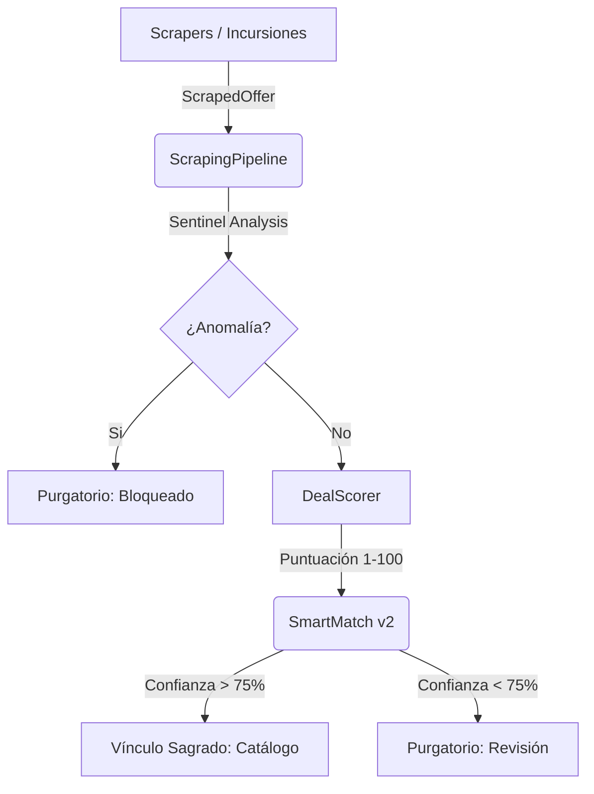

# 📜 EL CÓDICE DE ETERNIA: Sinergia Técnica

Este documento es una reliquia viva que describe la intersección de tecnologías, herramientas y procesos que dan vida a **Nueva Eternia**. A diferencia del Roadmap (visión) o el Log (historia), el Códice explica el **CÓMO** todo funciona en conjunto de manera incremental.

---

## 🏗️ El Ecosistema de Datos

El Oráculo procesa datos a través de una arquitectura de capas diseñada para la resiliencia:

### 🛠️ Herramientas de Infiltración (Tech Stack)
1.  **Playwright**: El motor de navegación invisible que permite saltar protecciones de Amazon y BBTS.
2.  **FastAPI Broker**: El puente entre la base de datos local (SQLite) y el estado global (Supabase).
3.  **Vite + React 19**: Interfaz líquida que permite al Arquitecto tomar decisiones en milisegundos.

---

## ⚡ Procesos Críticos

### 1. La Vía del Purgatorio (Data Lifecycle)
Cada hallazgo debe pasar por el Purgatorio a menos que la confianza sea absoluta. 
- **Ghost Sync**: El frontend guarda acciones localmente si la API no responde, asegurando que el Arquitecto nunca pierda su trabajo.
- **Auto-Clear**: El sistema limpia alias y mapeos fallidos para no repetir errores de vinculación pasados.

### 2. El Oráculo Logístico (Financial Truth)
No todos los precios son reales. El sistema calcula el **Landed Price**:
- `(Precio + Envío) * IVA + Tasas aduaneras`.
- Reglas específicas pre-cargadas para tiendas como **BigBadToyStore** (EE.UU.) y **Fantasia Personajes** (ES).

### 3. El Radar de Oportunidades (Market Intelligence)
El sistema compara cada precio con el **Percentil 25 (Suelo de Mercado)** generado por el histórico de ActionFigure411. Esto permite detectar un "Grial" antes de que el mercado reaccione.

---

## 🛡️ Protocolos de Resiliencia (3OX)

Nueva Eternia está blindada contra:
- **Detección Bot**: Mediante rotación de User-Agents y simulación humana (Sirius A1).
- **Inconsistencia de Red**: Transacciones atómicas con ROLLBACK automático ante fallos de Supabase.
- **Corrupción Visual**: Validaciones de UTF-8 y blindaje Unicode para terminales Windows.

---

*Última actualización: 01/02/2026 - Era de la Sincronización Total.*
