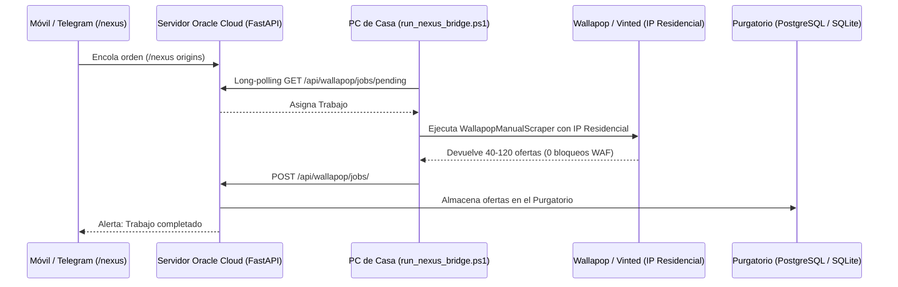
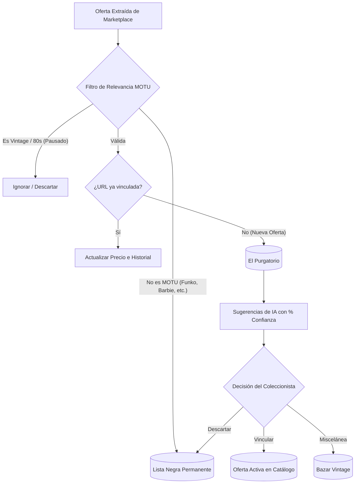

# 🧠 Estrategias Avanzadas de Web Scraping e Inteligencia de Mercado (Guía Técnica 2026)

**El Oráculo de Nueva Eternia — Framework de Extracción Programática de Alto Rendimiento y Bajo Coste**  
*Actualizado y adaptado al estado del arte de la ingeniería de datos, evasión de WAFs y arquitecturas híbridas.*

---

## 📑 Tabla de Contenidos

1. [Visión General y Retos en la Era de los WAFs Modernos](#1-visión-general-y-retos-en-la-era-de-los-wafs-modernos)
2. [Anatomía de la Detección Anti-Bot (JA4, TLS y HTTP/2 Fingerprinting)](#2-anatomía-de-la-detección-anti-bot-ja4-tls-y-http2-fingerprinting)
3. [Herramientas de Evasión de Próxima Generación (`curl_cffi`, Patchright, Camoufox)](#3-herramientas-de-evasión-de-próxima-generación)
4. [Arquitectura Híbrida de Nodos Residenciales: El Modelo Nexus Local Bridge](#4-arquitectura-híbrida-de-nodos-residenciales-el-modelo-nexus-local-bridge)
5. [Ingeniería Inversa de APIs Internas y Firmas Criptográficas](#5-ingeniería-inversa-de-apis-internas-y-firmas-criptográficas)
   - *5.1 Wallapop: Firma HMAC X-Signature y API v3*
   - *5.2 Vinted: Ciclo de Sesiones, Cookies CSRF y Endpoints de Catálogo*
   - *5.3 eBay: Estrategia de Doble Spider y Filtrado de Ruido*
6. [Extracción Pasiva y Segura mediante Extensiones de Navegador (Zero-Request Scraping)](#6-extracción-pasiva-y-segura-mediante-extensiones-de-navegador)
7. [Extracción Semántica Asistida por IA y Auto-Reparación de Selectores](#7-extracción-semántica-asistida-por-ia)
8. [Estrategia de Persistencia y Calidad de Datos: El Patrón "Purgatorio Primero"](#8-estrategia-de-persistencia-y-calidad-de-datos)
9. [Orquestación FinOps: Rotación de Tokens Gratuitos y Circuit Breakers](#9-orquestación-finops-rotación-de-tokens-gratuitos-y-circuit-breakers)
10. [Marco Legal y Cumplimiento Normativo (España y la Unión Europea)](#10-marco-legal-y-cumplimiento-normativo)

---

## 1. Visión General y Retos en la Era de los WAFs Modernos

En el ecosistema de comercio electrónico actual (Amazon, Wallapop, Vinted, eBay, etc.), la recopilación masiva de datos enfrenta contramedidas que van mucho más allá de un simple bloqueo por IP o análisis de `User-Agent`. 

Los Web Application Firewalls (CloudFront, Cloudflare Turnstile, DataDome, Akamai, AWS WAF) analizan:
* **Capas de Transporte y Cifrado:** Huellas TLS/SSL (JA3, JA4) y marcos de control HTTP/2.
* **Huella Digital del Navegador (Browser Fingerprinting):** Entornos de ejecución JavaScript, APIs de WebGL/Canvas, audio contextual y detección de variables de automatización como `navigator.webdriver`.
* **Reputación de Red (ASN Scoring):** Bloqueo automático de rangos de direcciones IP pertenecientes a centros de datos (Oracle Cloud, AWS, Hetzner, DigitalOcean) independientemente del comportamiento del cliente.

**El objetivo de esta guía es proporcionar el manual técnico para superar estas barreras a coste cero o marginal**, implementando las estrategias que rigen el backend y los spiders de *El Oráculo de Nueva Eternia*.

---

## 2. Anatomía de la Detección Anti-Bot (JA4, TLS y HTTP/2 Fingerprinting)

### 2.1 La trampa de las librerías HTTP tradicionales (`requests`, `urllib`, `aiohttp`)
Cuando se usa `requests` o `urllib3` en Python, la librería negocia la conexión TLS utilizando el conjunto de cifrado (*cipher suites*) y extensiones de OpenSSL por defecto de Python. Los WAFs identifican esta huella (JA3/JA4) en el milisegundo cero y devuelven un código `HTTP 403 Forbidden` sin llegar a evaluar la cabecera `User-Agent`.

### 2.2 Huellas HTTP/2 (Frames & Settings)
Los navegadores reales (Chrome, Firefox, Safari) envían parámetros específicos en las tramas `SETTINGS`, `WINDOW_UPDATE` y `PRIORITY` de HTTP/2. Un script automatizado que use HTTP/1.1 o una implementación HTTP/2 incompleta es catalogado de inmediato como bot.

---

## 3. Herramientas de Evasión de Próxima Generación

Para superar la inspección de tráfico sin recurrir a costosos servicios de proxies gestionados:

### A. Impersonación TLS con `curl_cffi` (Recomendado para APIs)
`curl_cffi` enlaza directamente con compilaciones de curl que clonan byte a byte el apretón de manos TLS y los marcos HTTP/2 de navegadores reales (Chrome 120+, Safari).

```python
from curl_cffi.requests import AsyncSession

async def fetch_protected_api(url: str, headers: dict) -> dict:
    async with AsyncSession(impersonate="chrome124") as session:
        response = await session.get(url, headers=headers)
        if response.status_code == 200:
            return response.json()
        raise Exception(f"HTTP {response.status_code}: Bloqueo WAF")
```

### B. Patchright y Camoufox (Automatización Headless Avanzada)
* **El problema de Playwright/Puppeteer estándar:** Al interactuar con el DOM vía Chrome DevTools Protocol (CDP), se generan fugas (*leaks*) internas (`Runtime.enable`, variables `cdc_...`) que Cloudflare Turnstile y DataDome detectan.
* **Patchright:** Fork de Playwright con parches en C++ para eliminar todos los artefactos de CDP.
* **Camoufox:** Navegador basado en Firefox parcheado a nivel de motor C++ que falsifica de forma nativa la huella de hardware (GPU, Canvas, Audio, WebRTC, fuentes instaladas).

---

## 4. Arquitectura Híbrida de Nodos Residenciales: El Modelo Nexus Local Bridge

### El Dilema del Datacenter vs. IP Residencial
* Alojar scrapers en la nube (ej. Oracle Cloud OCI) es ideal por disponibilidad, pero sus IPs de datacenter están vetadas por el WAF de CloudFront en Wallapop.
* Comprar proxies residenciales comerciales cuesta entre **$5 y $15 por GB**, resultando insostenible a largo plazo.

### La Solución: Nexus Local Bridge (BYO-IP: Bring Your Own IP)
En lugar de pagar proxies, el sistema desacopla la **orquestación** (servidor en la nube) de la **ejecución** (máquina local del usuario con IP de fibra o 4G/5G residencial limpia):



**Ventajas clave:**
1. **0€ de coste mensual.**
2. **0 bloqueos:** La IP residencial española tiene la máxima reputación de confianza ante los WAFs.
3. **Control total desde el móvil:** El usuario puede encolar búsquedas desde cualquier parte mediante Telegram.

---

## 5. Ingeniería Inversa de APIs Internas y Firmas Criptográficas

Consultar las APIs internas de las aplicaciones móviles o SPAs (Single Page Applications) es entre **10x y 50x más rápido** y consume un **90% menos de recursos** que renderizar HTML completo con navegadores headless.

### 5.1 Wallapop: Firma HMAC `X-Signature`
La API v3 de Wallapop (`/api/v3/search`) exige una cabecera `X-Signature` calculada sobre la petición:

$$\text{Signature} = \text{Base64}(\text{HMAC-SHA256}(\text{Key}, \text{Method} \parallel \text{Path} \parallel \text{Timestamp}))$$

```python
import hmac, hashlib, base64, time

def generate_wallapop_signature(method: str, path: str, secret_key_b64: str) -> tuple[str, str]:
    timestamp = str(int(time.time() * 1000))
    payload = f"{method.upper()}|{path}|{timestamp}".encode("utf-8")
    key = base64.b64decode(secret_key_b64)
    signature = base64.b64encode(hmac.new(key, payload, hashlib.sha256).digest()).decode("utf-8")
    return signature, timestamp
```

### 5.2 Vinted: Inicialización de Sesiones y Cookies CSRF
Vinted no usa firma HMAC estática, sino **validación de sesión por cookies**. Una consulta a la API de catálogo (`/api/v2/catalog/items`) falla de inmediato si no se ha realizado un apretón de manos inicial a la home (`https://www.vinted.es`) para capturar la cookie de sesión `_vinted_fr_session` o el token CSRF.

### 5.3 eBay: Doble Spider y Cascada de Selectores
1. **Search Spider (Amplitud):** Escanea páginas de búsqueda, extrae IDs y descarta elementos promocionales (*"Shop on eBay"*).
2. **Product Spider (Profundidad):** Visita únicamente los ítems confirmados, aplicando selectores en cascada (*fallback chain*) para resistir cambios de diseño en el DOM.

---

## 6. Extracción Pasiva y Segura mediante Extensiones de Navegador (Zero-Request Scraping)

Para marketplaces hiper-protegidos donde incluso los navegadores sigilosos presentan riesgos de baneo temporal:

### El Principio de Extracción del DOM Renderizado
* En lugar de que un bot realice peticiones automatizadas, **el usuario navega de forma 100% natural** desde su navegador web (Chrome, Edge, o Kiwi Browser en Android).
* Una extensión de navegador ligera (`chrome-extension/`) inyecta un content script que lee los elementos ya pintados en pantalla tras el scroll.
* Un botón flotante (*"Enviar al Oráculo"*) recolecta todos los productos visibles y los envía en bloque al endpoint `/api/wallapop/import` del backend.
* **Riesgo de Baneo:** **CERO**, ya que los servidores de Wallapop o Vinted únicamente registran la navegación legítima de un humano real.

---

## 7. Extracción Semántica Asistida por IA y Auto-Reparación de Selectores

El mantenimiento manual de selectores CSS/XPath rotos representa el mayor coste de tiempo en proyectos de web scraping.

### Extracción Basada en Esquemas JSON con LLMs Ligeros
En lugar de depender de clases CSS volátiles (ej. `.x-price-approx__price`), se extrae el texto limpio o fragmento HTML del artículo y se procesa con modelos de inferencia ultrarrápida (Gemini Flash / GPT-4o-mini):

```python
from pydantic import BaseModel, Field

class ItemSchema(BaseModel):
    title: str = Field(description="Nombre comercial de la figura")
    price: float = Field(description="Precio numérico en euros")
    is_vintage: bool = Field(description="True si es de los años 80, False si es Origins/moderno")
    condition: str = Field(description="MOC, Loose, Completo, Incompleto")
```

---

## 8. Estrategia de Persistencia y Calidad de Datos: El Patrón "Purgatorio Primero"

Los datos extraídos de plataformas P2P (Wallapop, Vinted, eBay) contienen ruido masivo: lotes mixtos, figuras incompletas, anuncios engañosos y errores de categorización.



### Reglas de Oro:
1. **Cero Auto-Vinculación a Ciegas:** Ningún scraper puede crear o asociar automáticamente una oferta a un producto del catálogo sin aprobación humana previa.
2. **Normalización Universal de URLs:** Se eliminan parámetros de tracking (`?utm_...`, `?ref=...`) y barras finales para evitar duplicados.
3. **Limpieza Global Proactiva:** Al terminar cada incursión, se purgan del Purgatorio aquellas ofertas que ya hayan sido catalogadas o bloqueadas.

---

## 9. Orquestación FinOps: Rotación de Tokens Gratuitos y Circuit Breakers

Para no incurrir en costes de suscripción de APIs comerciales:

1. **Pool de Cuentas Gratuitas:** Configuración de múltiples tokens de nivel gratuito (ej. `APIFY_TOKEN`, `APIFY_TOKEN2`, `APIFY_TOKEN3`).
2. **Conmutación en Caliente (Failover):** Si el Token 1 devuelve `HTTP 402 Payment Required` o `429 Too Many Requests`, el orquestador pasa inmediatamente al Token 2 sin abortar el scraping.
3. **Auditoría a Coste 0 (`/tokens`):** Consulta directa a los endpoints de metadatos (`/v2/users/me` o `/account`) para conocer el saldo restante sin consumir créditos de búsqueda.
4. **Circuit Breaker:** Si todos los servicios externos fallan, el sistema conmuta automáticamente al **Nexus Local Bridge** para resolver la búsqueda localmente.

---

## 10. Marco Legal y Cumplimiento Normativo (España y la Unión Europea)

### 10.1 Jurisprudencia del Tribunal Supremo (STS 572/2012 — Ryanair vs. Atrápalo)
El Tribunal Supremo español determinó que el scraping de datos **públicos y factuales** (precios, disponibilidad, nombres de productos) con fines de comparación y transparencia de mercado es **completamente legal** y amparado por la libre competencia, siempre que:
* No suponga una sobrecarga técnica (DoS) para los servidores de la plataforma.
* No se vulnere el secreto comercial ni se suplante la identidad de usuarios.

### 10.2 Directrices RGPD y LSSI
* **Protección de Datos Personales (PII):** Queda estrictamente prohibido persistir datos personales de vendedores particulares (números de teléfono, emails, direcciones postales o nombres reales). Únicamente se extraen datos del objeto mercantil.
* **Minimización de Datos:** Recolectar exclusivamente los atributos necesarios para el cálculo patrimonial y del valor de mercado.