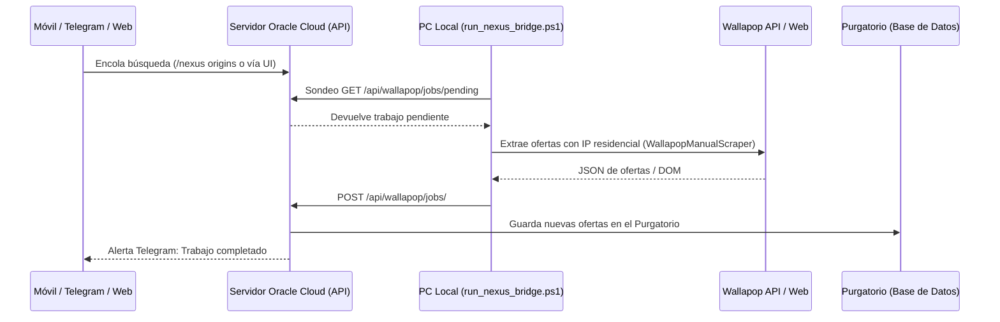

# 🕵️ Guía Maestra de Scraping, Wallapop, Vinted y Nexus Local Bridge

Este documento unifica y detalla toda la arquitectura de recolección de datos e inteligencia de mercado de **El Oráculo de Nueva Eternia**, abarcando las plataformas P2P (Wallapop, Vinted, eBay) y las tiendas minoristas europeas.

---

## 1. Arquitectura de Extracción P2P: Wallapop

Wallapop implementa fuertes medidas de protección mediante CloudFront WAF y huellas de navegador TLS/JA3. El sistema cuenta con dos vías principales de extracción:

### Vía A: Nexus Local Bridge (Worker Residencial en PC) — *0 Coste / 0 Bloqueos*

Es la solución definitiva contra los bloqueos de CloudFront. Las peticiones a Wallapop se ejecutan desde el PC de casa del usuario (con su IP residencial española) y los resultados se suben a la nube.



#### Uso desde el Móvil / Telegram:
- `/nexus`: Ejecuta automáticamente las 3 búsquedas preconfiguradas de MOTU Origins:
  1. `masters del universo origins`
  2. `masters of the universe origins`
  3. `motu origins`
- `/nexus [búsqueda]`: Ejecuta un término específico (ej: `/nexus he-man`).
- `/nexus [t1], [t2], [t3]`: Ejecuta múltiples búsquedas separadas por comas.

#### Ejecución en PC:
```powershell
.\run_nexus_bridge.ps1
```

---

### Vía B: Cascada en Servidor Cloud (`WallapopScraper`)

Para ejecuciones autónomas en el servidor sin PC encendido, el scraper utiliza una cascada de prioridades:

1. **Nivel 1 — Rotación de Tokens de Apify:**
   - Rota automáticamente entre 3 tokens independientes (`APIFY_TOKEN`, `APIFY_TOKEN2`/`APYFY_TOKEN2`, `APIFY_TOKEN3`).
   - Utiliza el actor `igolaizola/wallapop-scraper` en la nube de Apify.
2. **Nivel 2 — API v3 Firmada (`wallapop_signed_api.py`):**
   - Reproduce la firma HMAC `X-Signature` e impersona la huella TLS de Chrome con `curl_cffi`.
   - Permite ruteo con proxy residencial (`WALLAPOP_RESIDENTIAL_PROXY`).
3. **Nivel 3 — ScraperAPI Cloud:**
   - Rutea peticiones con Javascript rendering en la nube de ScraperAPI si hay créditos disponibles.
4. **Auditoría de Cuotas a Coste 0:**
   - Comando `/tokens` en Telegram para auditar créditos consumidos y disponibles en Apify y ScraperAPI sin gastar saldo.

---

## 2. Extracción en Vinted

- **Scraper Autónomo (`vinted_scraper.py`):**
  - Utiliza `curl_cffi` con impersonación de Chrome y rotación de cookies de sesión para consultar directamente la API interna (`https://www.vinted.es/api/v2/catalog/items`).
  - Totalmente gratuito y sin dependencia de servicios de pago.

---

## 3. Extracción Minorista: Smyths Toys (Alemania) y Evasión WAF Imperva

Smyths Toys cuenta con el cortafuegos anti-bot **Imperva / Incapsula** que bloquea peticiones automáticas headless.

### Procedimiento de 2 Pasos en el Centro de Control (`oraculo.ps1`):
1. **Paso 1 — Opción [5]:** Iniciar Google Chrome en Depuración (`Puerto 9222`).
2. **Paso 2 — Opción [12]:** Lanzar Incursión Directa Smyths Toys.
- **Resultado:** `SmythsToysScraper` se conecta vía **CDP** a la ventana de Chrome abierta, navega a la sección MOTU de Smyths Toys sin ser detectado como bot por Imperva, extrae todas las figuras e importes y actualiza automáticamente los precios en Supabase y el Purgatorio.

---

## 4. Estandarización de Etiquetado: Nombre Canónico `Wallapop`

Por directriz de negocio:
- Todas las ofertas extraídas desde Wallapop (vía Nexus Local Bridge, API v3 firmada o importación asistida) quedan registradas bajo el nombre de tienda **`Wallapop`** (reemplazando a la etiqueta legacy `WallapopManual`).
- Garantiza búsquedas homogéneas en el Purgatorio y notificaciones coherentes en Telegram.

---

## 5. Extensión de Navegador Multitienda (`chrome-extension/`)

Permite capturar **páginas completas** de búsqueda (50-200 productos) de forma masiva con **CERO riesgo de baneo**:

1. **Compatibilidad:** Funciona en **Wallapop** (`wallapop.com`) y **Vinted** (`vinted.es`, `vinted.fr`, `vinted.com`).
2. **Mecanismo:** El usuario navega naturalmente en su navegador (PC o móvil con Kiwi/Lemur Browser) y hace scroll.
3. **Extracción DOM:** La extensión lee los elementos que el navegador ya renderizó y los envía al endpoint `/api/wallapop/import` del backend con 1 clic en el botón dorado **"Enviar al Oráculo"**.
4. Al no realizar peticiones automáticas contra los servidores de Wallapop/Vinted, no hay posibilidad de detección anti-bot.

---

## 6. Política de Persistencia: "Purgatorio Primero"

Por directriz estricta del proyecto:
- **Ninguna oferta nueva** de Wallapop, Vinted ni tiendas se auto-vincula a ciegas al catálogo de figuras.
- El **100% de las nuevas ofertas** ingresan en la tabla `pending_matches` (El Purgatorio) para que el coleccionista revise, confirme la vinculación o descarte la oferta.
- Si una URL ya existía previamente vinculada a una figura, el sistema actualiza su precio e histórico automáticamente sin crear duplicados.
