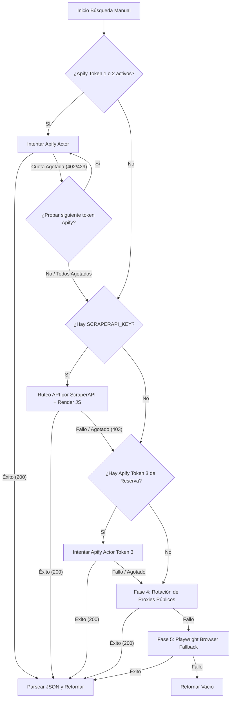

# 🕵️ Guía Técnica: Wallapop Hybrid Nexus (Scraper API & Playwright)

Este documento detalla la arquitectura de infiltración y el motor de extracción híbrida desarrollado para Wallapop, diseñado para superar los estrictos bloqueos de CloudFront WAF (HTTP 403 / 500) y obtener las ofertas del mercado P2P.

---

## 🏗️ 1. Arquitectura del Motor Híbrido y Cascada de Evasión

Para maximizar la velocidad y evadir las penalizaciones por comportamiento automatizado (WAF de CloudFront), el sistema cuenta con un flujo secuencial inteligente (cascada) diseñado **exclusivamente para llamadas manuales** (las rondas automáticas de fondo se omiten para preservar cuotas):



| Nivel / Fase | Componente / API | Función y Evasión WAF |
| :--- | :--- | :--- |
| **Nivel 1 (Apify Principal)** | `APIFY_TOKEN` y `APIFY_TOKEN2` | Bypass síncrono gratuito de CloudFront delegando al actor `igolaizola/wallapop-scraper` en la nube. Si el primer token se agota, conmuta en caliente al segundo token automáticamente. |
| **Nivel 2 (Proxy Cloud)** | ScraperAPI (Premium ES + Render) | Rutea la llamada directa a `api.wallapop.com` resolviendo Javascript en la nube para saltar retos de CloudFront. |
| **Nivel 2.5 (Apify Reserva)** | `APIFY_TOKEN3` | Cuenta secundaria de Apify que actúa como última línea de defensa rápida en caso de que ScraperAPI y los dos primeros tokens de Apify se queden sin créditos. |
| **Nivel 3 (Rotación de Proxies)** | Proxies públicos dinámicos | Cosecha proxies de Geonode/ProxyScrape y realiza reintentos dinámicos en paralelo. |
| **Nivel 4 (Navegador Local)** | Playwright persistent profile | Levantado de instancia local de navegador emulando clicks e interacciones humanas si todas las APIs previas fallan. |

---

## 🚀 2. Protocolo de Infiltración y Evasión de Bloqueos (Playwright Fallback)

### A. Evasión de `navigator.webdriver`
Playwright inyecta por defecto la propiedad `navigator.webdriver = true`, la cual es leída inmediatamente por scripts de protección de bot. El scraper sanitiza la sesión al vuelo agregando un script de inicialización del DOM:
```javascript
Object.defineProperty(navigator, 'webdriver', { get: () => undefined });
Object.defineProperty(navigator, 'languages', { get: () => ['es-ES', 'es', 'en'] });
```

### B. Evitar el error de cabeceras en Proxy
Cuando se rutean consultas de API a través de proxies premium en la nube, se debe evitar el parámetro `keep_headers: true`. Las cabeceras `Origin` y `Referer` locales entran en conflicto con la rotación de IPs residenciales de ScraperAPI, provocando que Cloudflare de Wallapop retorne códigos de estado `500` (Internal Server Error) o peticiones truncadas.

### C. Navegación e Interacción Humana (Fallback)
Cuando se ejecuta la extracción vía Web:
1. **Salto de Banner**: Se detecta y hace clic en el botón de cookies de OneTrust (`#onetrust-accept-btn-handler` o `"Aceptar todo"`).
2. **El Click Maestro**: Wallapop desactiva el scroll infinito inicial. El scraper hace scroll hacia abajo, localiza el botón **"Cargar más"**, ejecuta el click para despertar el Javascript de hidratación y recién inicia las llamadas dinámicas.
3. **Simulación de Rodamiento**: Se implementa `page.mouse.wheel(0, 1500)` con retardos aleatorios para evitar patrones de barrido fijos.

---

## 🔎 3. Extracción y Normalización

### Selectores Web (HTML)
Debido a la ofuscación aleatoria de clases CSS en la web de Wallapop, la extracción utiliza selectores basados en estructuras semánticas y enlaces del DOM:
* **Tarjeta de Item**: `a[href*='/item/']` (Captura todos los productos cargados en el feed).
* **Precio**: `span[class*='Price'], [class*='price']` (Filtra caracteres monetarios y convierte coma decimal).
* **Título**: `p[class*='Title'], [class*='title']`.
* **Imagen**: `img` (Selecciona el atributo `src`).

---

## 🛠️ 4. Auditoría IP y Monitoreo de Red
El sistema audita cada intento de evasión guardando logs detallados de la IP de origen y el estado en la base de datos Supabase a través del modelo `WallapopIpLogModel`:
* `status = "allowed"`: La IP local/directa navegó sin inconvenientes.
* `status = "blocked"`: Se detectó el bloqueo WAF de CloudFront.
* `status = "proxy_bypass"`: Bypass exitoso ruteado por canal en la nube.

*Desarrollado bajo el estándar de seguridad y resiliencia 3OX para el Oráculo de Nueva Eternia.*
