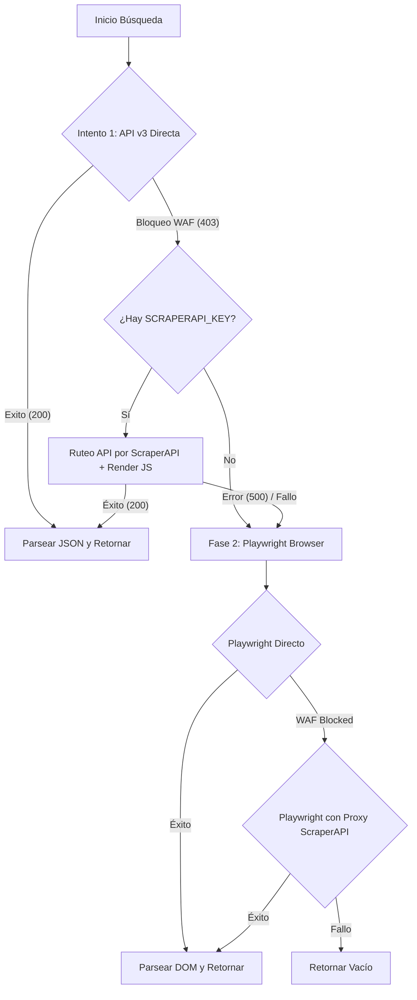

# 🕵️ Guía Técnica: Wallapop Hybrid Nexus (Scraper API & Playwright)

Este documento detalla la arquitectura de infiltración y el motor de extracción híbrida desarrollado para Wallapop, diseñado para superar los estrictos bloqueos de CloudFront WAF (HTTP 403 / 500) y obtener las ofertas del mercado P2P.

---

## 🏗️ 1. Arquitectura del Motor Híbrido

Para maximizar la velocidad y evadir las penalizaciones por comportamiento automatizado, el sistema cuenta con un flujo secuencial inteligente de dos fases:



| Capa / Estrategia | Componente / Método | Función y Evasión WAF |
| :--- | :--- | :--- |
| **API Directa** | `curl_cffi` (Chrome 120) | Mimetiza el TLS fingerprint (JA3/JA4) de un navegador moderno para engañar a las comprobaciones iniciales de Cloudflare. |
| **API Cloud Proxy** | ScraperAPI (Premium ES) | Si la API directa falla (403), se delega el endpoint `api.wallapop.com/api/v3/general/search` con `"render": "true"` y `"premium": "true"`. La renderización de JS en la nube resuelve el desafío matemático sin alertar al WAF local, y se descarta `keep_headers` para prevenir colisiones de proxy. |
| **Browser Fallback** | Playwright Persistent Context | Si el consumo de la API falla, se levanta una instancia local en segundo plano reutilizando cookies en carpetas temporales (`playwright_wallapop_profile_direct`). |
| **Browser Proxy** | Tunnel ScraperAPI HTTP | Si el navegador directo es interceptado por WAF, se reinicia el contexto web encapsulándolo en el proxy residencial de España (`proxy-server.scraperapi.com:8001`). |

---

## 🚀 2. Protocolo de Infiltración y Evasión de Bloqueos

### A. Evasión de `navigator.webdriver`
Playwright inyecta por defecto la propiedad `navigator.webdriver = true`, la cual es leída inmediatamente por scripts de protección de bot. El scraper sanitiza la sesión al vuelo agregando un script de inicialización del DOM:
```javascript
Object.defineProperty(navigator, 'webdriver', { get: () => undefined });
Object.defineProperty(navigator, 'languages', { get: () => ['es-ES', 'es', 'en'] });
```

### B. Evitar el error de cabeceras en Proxy
Cuando se rutean consultas de API a través de proxies premium en la nube, se debe evitar el parámetro `keep_headers: true`. Las cabeceras `Origin` y `Referer` locales entran en conflicto con la rotación de IPs residenciales de ScraperAPI, provocando que Cloudflare de Wallapop retorne códigos de estado `500` (Internal Server Error) o peticiones truncadas.

### C. Navegación e Interacción Humana (Fallback)
Cuando se ejecuta la extracción vía Web:
1. **Salto de Banner**: Se detecta y hace clic en el botón de cookies de OneTrust (`#onetrust-accept-btn-handler` o `"Aceptar todo"`).
2. **El Click Maestro**: Wallapop desactiva el scroll infinito inicial. El scraper hace scroll hacia abajo, localiza el botón **"Cargar más"**, ejecuta el click para despertar el Javascript de hidratación y recién inicia las llamadas dinámicas.
3. **Simulación de Rodamiento**: Se implementa `page.mouse.wheel(0, 1500)` con retardos aleatorios para evitar patrones de barrido fijos.

---

## 🔎 3. Extracción y Normalización

### Selectores Web (HTML)
Debido a la ofuscación aleatoria de clases CSS en la web de Wallapop, la extracción utiliza selectores basados en estructuras semánticas y enlaces del DOM:
* **Tarjeta de Item**: `a[href*='/item/']` (Captura todos los productos cargados en el feed).
* **Precio**: `span[class*='Price'], [class*='price']` (Filtra caracteres monetarios y convierte coma decimal).
* **Título**: `p[class*='Title'], [class*='title']`.
* **Imagen**: `img` (Selecciona el atributo `src`).

---

## 🛠️ 4. Auditoría IP y Monitoreo de Red
El sistema audita cada intento de evasión guardando logs detallados de la IP de origen y el estado en la base de datos Supabase a través del modelo `WallapopIpLogModel`:
* `status = "allowed"`: La IP local/directa navegó sin inconvenientes.
* `status = "blocked"`: Se detectó el bloqueo WAF de CloudFront.
* `status = "proxy_bypass"`: Bypass exitoso ruteado por canal en la nube.

*Desarrollado bajo el estándar de seguridad y resiliencia 3OX para el Oráculo de Nueva Eternia.*
