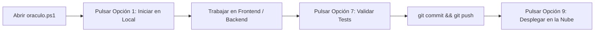
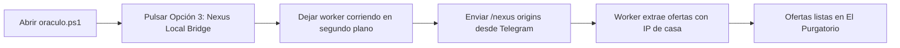
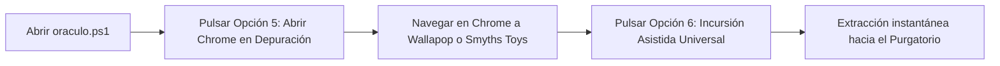
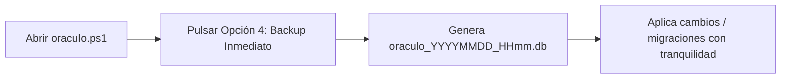

# 📖 Manual de Operaciones y Centro de Control (`oraculo.ps1`)

**El Oráculo de Nueva Eternia — Guía Integral de Ejecución y Automatización**  
*Manual técnico y operativo para la administración soberana del sistema en local y producción.*

---

## 🎯 1. ¿Qué es `oraculo.ps1`?

`oraculo.ps1` es el **Centro de Control Unificado** en PowerShell para gestionar todo el ecosistema de *El Oráculo de Nueva Eternia* desde una única terminal interactiva. Elimina la necesidad de memorizar comandos, rutas o nombres de scripts individuales.

Para abrirlo, simplemente abre PowerShell en la raíz del proyecto y escribe:
```powershell
.\oraculo.ps1
```
*(O haz doble clic sobre el acceso directo **"Oraculo - Centro de Control"** en tu Escritorio de Windows).*

---

## 📋 2. Menú Principal de Opciones

```text
===================================================================
      ⚔️  EL ORÁCULO DE NUEVA ETERNIA — CENTRO DE CONTROL  ⚔️     
===================================================================

  [1] 🚀 Iniciar Oráculo en Local (Backend + Frontend Nativo)
  [2] 🚢 Iniciar Oráculo en Docker (The Ark Stack)
  [3] 🌐 Iniciar Nexus Local Bridge (Worker Residencial Wallapop)
  [4] 🛡️ Realizar Copia de Seguridad Inmediata (DB Backup)
  [5] 🔌 Abrir Google Chrome en Depuración (Puerto 9222)
  [6] 🎯 Incursión Asistida Universal (CDP Multi-tienda)
  [7] 🧪 Ejecutar Suite Completa de Tests y Diagnóstico
  [8] 🔗 Crear / Actualizar Accesos Directos en el Escritorio
  [9] ☁️ Desplegar y Actualizar en Oracle Cloud (1 Clic)
  [10] 💻 Conectar por SSH al Servidor en la Nube

  [0] 🚪 Salir
-------------------------------------------------------------------
  👉 Selecciona una opción [0-10]: _
```

---

## 🛠️ 3. Detalle Exhaustivo de cada Opción

---

### 🚀 Opción [1] — Iniciar Oráculo en Local (Backend + Frontend Nativo)
* **Propósito:** Entorno de trabajo diario de desarrollo y visualización en tu máquina.
* **Mecanismo de Ejecución:**
  1. **Limpieza de Puertos:** Escanea y libera automáticamente los puertos `8000`, `3001`, `5173` y `5174`, cerrando procesos huérfanos anteriores para evitar errores de *"Address already in use"*.
  2. **Lanzamiento Backend:** Abre una ventana independiente de PowerShell titulada `ORÁCULO - BACKEND (API)` ejecutando `python -m src.interfaces.api.main` (FastAPI en `http://localhost:8000`).
  3. **Lanzamiento Frontend:** Abre una segunda ventana de PowerShell titulada `ORÁCULO - FRONTEND (UX)` ejecutando `npm run dev` en la carpeta `frontend/` (React + Vite en `http://localhost:3001`).
* **Requisitos Previos:**
  * Entorno virtual Python (`.venv`) con dependencias instaladas (`pip install -r requirements.txt`).
  * Dependencias de Node instaladas (`npm install` dentro de `frontend/`).
* **URLs Resultantes:**
  * **App Web:** `http://localhost:3001`
  * **Documentación Swagger API:** `http://localhost:8000/docs`

---

### 🚢 Opción [2] — Iniciar Oráculo en Docker (The Ark Stack)
* **Propósito:** Ejecutar la infraestructura completa en contenedores idénticos a los del servidor de producción.
* **Mecanismo de Ejecución:**
  1. Ejecuta `docker-compose down` para limpiar contenedores antiguos.
  2. Ejecuta `docker-compose up --build -d` para construir y arrancar en segundo plano los servicios de backend y frontend Nginx.
* **Requisitos Previos:**
  * Tener **Docker Desktop** iniciado y funcionando en Windows.
* **URLs Resultantes:**
  * `http://localhost:3001` o `http://localhost`

---

### 🌐 Opción [3] — Iniciar Nexus Local Bridge (Worker Residencial Wallapop)
* **Propósito:** Convertir tu PC doméstico en un nodo extractor con **IP Residencial limpia** para Wallapop y Vinted, evitando el 100% de los bloqueos de WAF (CloudFront/DataDome) que sufren los datacenters.
* **Mecanismo de Ejecución:**
  1. Arranca en primer plano el script `scripts/nexus_local_worker.py`.
  2. Sondea cada 10-20 segundos la tabla `wallapop_jobs` del servidor buscando tareas pendientes.
  3. Cuando encolas una búsqueda desde Telegram (`/nexus`) o desde el panel web, el worker la procesa localmente usando la API firmada v3 (`X-Signature`), extrae las ofertas y las envía directamente al **Purgatorio**.
  4. Al finalizar, el servidor notifica a tu móvil por Telegram.
* **Requisitos Previos:**
  * Estar conectado a tu red de fibra o 4G/5G de casa.
  * Tener configurada la variable `ORACULO_API_BASE_URL` en tu `.env` (apuntando a `http://localhost:8000` si trabajas en local o a `https://oraculo-eternia.duckdns.org` si trabajas contra la nube).
* **Cómo detenerlo:** Presiona `Ctrl + C` en cualquier momento.

---

### 🛡️ Opción [4] — Realizar Copia de Seguridad Inmediata (DB Backup)
* **Propósito:** Crear una instantánea íntegra y segura de la base de datos local `oraculo.db` sin riesgo de corrupción.
* **Mecanismo de Ejecución:**
  1. Utiliza la API online `sqlite3.backup()` de Python en lugar de un copiado simple de ficheros (fundamental para no perder datos en modo WAL mientras la app está abierta).
  2. Guarda la copia en `backups/oraculo_YYYYMMDD_HHmm.db`.
  3. **Rotación automática:** Mantiene ordenados los backups y elimina los antiguos, conservando los **10 más recientes** para no saturar el disco.
* **Requisitos Previos:** Ninguno.

---

### 🔌 Opción [5] — Abrir Google Chrome en Depuración (Puerto 9222)
* **Propósito:** Iniciar una instancia real de Google Chrome preparada para recibir conexiones de control remoto (CDP) con camuflaje total anti-bot.
* **Mecanismo de Ejecución:**
  1. Localiza automáticamente `chrome.exe` en las rutas estándar de Windows.
  2. Abre Chrome con el flag `--remote-debugging-port=9222`.
  3. Utiliza un perfil temporal aislado en `scratch/chrome_dev` con los flags `--disable-blink-features=AutomationControlled`, `--no-first-run` y `--no-default-browser-check`.
* **Requisitos Previos:** Google Chrome instalado en Windows.
* **Uso combinado:** Es el **Paso 1** para el scraping asistido. En esta ventana de Chrome abres la tienda deseada (Wallapop, Vinted, Smyths Toys), navegas normalmente y luego lanzas la **Opción [6]**.

---

### 🎯 Opción [6] — Incursión Asistida Universal (CDP Multi-tienda)
* **Propósito:** Extraer masivamente todas las ofertas de la pestaña que tengas abierta en el Chrome de depuración.
* **Mecanismo de Ejecución:**
  1. Se conecta vía WebSocket a `http://localhost:9222`.
  2. Ejecuta `scripts/scrape_multi_via_cdp.py`.
  3. Detecta automáticamente si la pestaña activa es **Wallapop**, **Vinted**, **Smyths Toys**, **eBay**, etc.
  4. Extrae títulos, precios, enlaces e imágenes del DOM ya pintado y los envía al Purgatorio.
* **Requisitos Previos:** Haber abierto Chrome con la **Opción [5]** y tener una pestaña con resultados de búsqueda.

---

### 🧪 Opción [7] — Ejecutar Suite Completa de Tests y Diagnóstico
* **Propósito:** Comprobar la integridad de todo el sistema antes de publicar cambios o realizar despliegues.
* **Mecanismo de Ejecución:**
  * Lanza `pytest tests/ -v` ejecutando los 67 tests automatizados:
    * Autenticación, JWT y Registro.
    * Control de Permisos y Escudo de Dispositivos (`SecurityShield`).
    * Esquemas JSON de todas las APIs y Rutas.
    * Operaciones del Purgatorio y Matcher de Relevancia MOTU.
    * Alertas multi-usuario de Telegram.
    * Telemetría y Renovación de Certificados SSL.
    * Cascada de Scrapers "Zero-Cost First" (Amazon, Smyths Toys, Apify).
* **Requisitos Previos:** Entorno virtual `.venv` activo.

---

### 🔗 Opción [8] — Crear / Actualizar Accesos Directos en el Escritorio
* **Propósito:** Generar o reparar con un solo clic los iconos de acceso rápido en tu Escritorio de Windows.
* **Mecanismo de Ejecución:**
  * Crea `Oraculo - Centro de Control.lnk` (apunta a `oraculo.ps1`).
  * Crea `Oraculo - Guardián de Backups.lnk` (apunta a `backup_db.ps1`).
* **Requisitos Previos:** Ninguno.

---

### ☁️ Opción [9] — Desplegar y Actualizar en Oracle Cloud (1 Clic)
* **Propósito:** Publicar automáticamente tus últimos cambios de código en tu servidor de producción sin tener que escribir comandos en Linux.
* **Mecanismo de Ejecución:**
  1. Conecta por SSH con tu clave privada `C:\Users\dace8\OneDrive\Documentos\nueva-eternia-produccion.key` al servidor `opc@79.72.50.244`.
  2. Ejecuta en el servidor de forma atómica:
     ```bash
     cd ~/oraculo-nueva-eternia && git reset --hard origin/main && git pull origin main && sudo docker compose -f docker-compose.prod.yml up -d --build
     ```
  3. Limpia cualquier conflicto de Git, descarga la última versión de `main` y reconstruye los contenedores de Docker de producción.
* **Requisitos Previos:** Haber hecho `git push origin main` desde tu máquina local.
* **URL de Producción:** `https://oraculo-eternia.duckdns.org`

---

### 💻 Opción [10] — Conectar por SSH al Servidor en la Nube
* **Propósito:** Abrir una sesión interactiva directa en la terminal de tu máquina virtual en Oracle Cloud.
* **Mecanismo de Ejecución:**
  * Ejecuta `ssh -i "C:\Users\dace8\OneDrive\Documentos\nueva-eternia-produccion.key" opc@79.72.50.244`.
* **Cuándo usarlo:** Para consultar logs en tiempo real (`sudo docker compose -f docker-compose.prod.yml logs -f`), verificar espacio en disco (`df -h`) o realizar tareas de mantenimiento avanzadas.

---

## 🗺️ 4. Mapa de Flujos de Ejecución por Caso de Uso

### 🔄 Flujo A: Ciclo Diario de Desarrollo Local


---

### 🛍️ Flujo B: Extracción Residencial con Nexus Bridge y Telegram


---

### 🕵️ Flujo C: Scraping Asistido con Navegador Real (CDP)


---

### 🛡️ Flujo D: Copia de Seguridad Previa a Cambios Críticos

