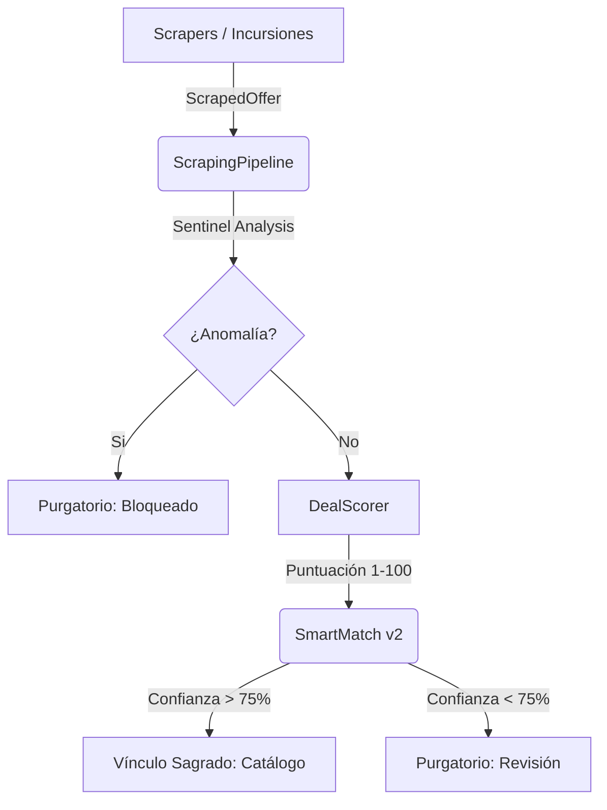

# 📜 EL CÓDICE DE ETERNIA: Sinergia Técnica

Este documento es una reliquia viva que describe la intersección de tecnologías, herramientas y procesos que dan vida a **Nueva Eternia**. A diferencia del Roadmap (visión) o el Log (historia), el Códice explica el **CÓMO** todo funciona en conjunto de manera incremental.

---

## 🏗️ El Ecosistema de Datos

El Oráculo procesa datos a través de una arquitectura de capas diseñada para la resiliencia:

### 🛠️ Herramientas de Infiltración (Tech Stack)
1.  **Playwright Nexus**: El motor de infiltración avanzada que permite saltar protecciones de Amazon, BBTS y Wallapop (Bypass 403) mediante simulación humana y expansión dinámica del DOM.
2.  **Sitemap Deep Scan (Eternia Shield)**: Estrategia de búsqueda de alta precisión para tiendas con motores internos mediocres (DVDStoreSpain), combinando descubrimiento XML con navegación directa.
3.  **FastAPI Broker**: El puente entre la base de datos local (SQLite) y el estado global (Supabase).
3.  **Vite + React 19**: Interfaz líquida que permite al Arquitecto tomar decisiones en milisegundos.

---

## ⚡ Procesos Críticos

### 1. La Vía del Purgatorio (Data Lifecycle)
Cada hallazgo debe pasar por el Purgatorio a menos que la confianza sea absoluta. 
- **Ghost Sync**: El frontend guarda acciones localmente si la API no responde, asegurando que el Arquitecto nunca pierda su trabajo.
- **Auto-Clear**: El sistema limpia alias y mapeos fallidos para no repetir errores de vinculación pasados.

### 2. El Oráculo Logístico (Financial Truth)
No todos los precios son reales. El sistema calcula el **Landed Price**:
- `(Precio + Envío) * IVA + Tasas aduaneras`.
- Reglas específicas pre-cargadas para tiendas como **BigBadToyStore** (EE.UU.) y **Fantasia Personajes** (ES).

### 4. Flota de Incursión Sincronizada (Phase 50)
El sistema ahora garantiza la visibilidad total de las 13 fuentes de datos.
- **Auto-Discovery**: La API registra automáticamente cualquier nuevo scraper al inicio del servidor.
- **Orquestación Dual**: Ejecución coordinada entre GitHub Actions (Daily Scan) y disparadores manuales desde el Purgatorio.
- **Trazabilidad Total**: Cada incursión genera un `ScraperExecutionLog` detallado que incluye items procesados, nuevos hallazgos y errores de red.

---

## 🛡️ Protocolos de Resiliencia y Seguridad (3OX)

Nueva Eternia está blindada mediante estos pilares de seguridad:

### 1. Gestión de Secretos (Zero-Leak Policy)
- **Variables de Entorno**: Todas las claves (Supabase, API Key, Telegram) residen exclusivamente en archivos `.env` o secretos de GitHub.
- **No Fallbacks**: Prohibida la inclusión de valores por defecto o hardcoded en el código fuente (especialmente en `admin.ts`).
- **Ignore Rules**: El sistema ignora automáticamente archivos `.html`, `.png` y `.log` generados durante el diagnóstico para evitar filtraciones de datos scrapeados.

### 2. Blindaje Operativo
- **Detección Bot**: Mediante rotación de User-Agents y simulación humana interactiva (Modo Sirius A1).
- **Inconsistencia de Red**: Transacciones atómicas con ROLLBACK automático ante fallos de Supabase.
- **Corrupción Visual**: Validaciones de UTF-8 y blindaje Unicode para terminales Windows.
- **Ghost Sync**: Búfer local de acciones administrativas para resiliencia offline.

---

*Última actualización: 01/02/2026 - Fase 51: Hardening de Seguridad & Remediación de Secretos.*
