# Arquitectura Técnica: Sistema de Incursión y Extracción (3OX)

Este documento detalla el funcionamiento interno, el flujo de ejecución y la arquitectura de datos de la **Incursión Total** y el **Daily Scan** de Nueva Eternia.

---

## 1. Visión General del Sistema
El sistema de extracción está diseñado bajo los principios de la arquitectura **3OX (Oracle-Optimized-Orchestration)**, priorizando el paralelismo, la normalización de datos y la seguridad de la información.

### Componentes Clave:
*   **Orquestador**: `src/infrastructure/scrapers/pipeline.py`
*   **Adaptador de Contrato**: `src/infrastructure/scrapers/adapter.py`
*   **Motor de Inteligencia**: `src/core/matching.py` (SmartMatcher)
*   **Interfaces de Disparo**: 
    *   API Backend (`main.py`) -> Incursión Total (Manual)
    *   Job Runner (`daily_scan.py`) -> Escaneo Diario (Automático)

---

## 2. Flujo de "Incursión Total" (Manual Trigger)

Cuando un Administrador activa la **Incursión Total** desde el Panel de Configuración, se inicia la siguiente secuencia:

### Fase A: Recepción del Comando (API)
1.  **Frontend**: Envía un `POST` a `/api/scrapers/run` con el payload `{"spider_name": "all"}`.
2.  **FastAPI (`main.py`)**: Valida la `X-API-Key` y delega la tarea a una `BackgroundTasks` de FastAPI. Esto permite que la respuesta HTTP sea instantánea (200 OK) mientras el proceso pesado ocurre en segundo plano.

### Fase B: Preparación de la Misión
1.  **`run_scraper_task`**: Se ejecuta en un hilo separado.
2.  **Purga de Logs**: Elimina registros de ejecución de más de 7 días.
3.  **Estado Global**: Actualiza la tabla `scraper_status` a `running` y crea una entrada en `scraper_execution_log`.
4.  **Inyección de Callback**: Se inyecta una función de log en vivo en cada spider para que el usuario pueda ver el progreso en tiempo real desde la consola táctica.

### Fase C: Ejecución Paralela
1.  **Pipeline Initialization**: El `ScrapingPipeline` recibe la lista de objetos Scraper.
2.  **`asyncio.gather`**: Orquesta la ejecución de todos los métodos `.search()` de forma concurrente.
3.  **Timeouts**: Cada spider tiene un límite rígido de 10 minutos (600s). Si una tienda no responde, se cancela individualmente para no bloquear al resto.

---

## 3. Flujo de "Daily Scan" (Automático)

El **Daily Scan** es un script autónomo diseñado para robustez industrial. Aunque comparte lógica con la incursion manual, incluye capas extra de seguridad:

| Característica | Daily Scan (`daily_scan.py`) | Incursión Total (API) |
| :--- | :--- | :--- |
| **Punto de Entrada** | CLI / Crontab / PowerShell | Botón UI (HTTP Request) |
| **Jitter (Retraso)** | Soporta `--random-delay` (Evita patrones fijos) | Inmediato |
| **Backup** | Crea backup de DB antes de empezar | No incluido por defecto |
| **PID Management** | Evita ejecuciones concurrentes colisionando | Controlado por el estado de la API |
| **Migración** | Ejecuta `migrate()` preventivo | No incluido |

> [!NOTE]
> **[2026-02-01] Módulo Harvester Deprecado**: El módulo `harvester.py` fue eliminado. Su funcionalidad ha sido absorbida por los scrapers del Pipeline (`frikiverso_scraper.py`, `fantasia_scraper.py`), que ya utilizan Playwright internamente con paginación automática y manejo de popups. Ver historial de commits para detalles.

---

## 4. Sincro Nexus: El Catálogo Maestro (Nexus Sync)

El botón **Sincro Nexo Maestro** es el corazón del ecosistema. A diferencia del Daily Scan, que busca ofertas, Nexus actualiza la "Enciclopedia" de productos conocidos.

### Modos de Ejecución
*   **Manual (Recomendado)**: Desde el Panel de Administración -> Configuración.
*   **Background Orchestration**: Se ejecuta como una `BackgroundTask` asíncrona mediante `NexusService.sync_catalog()`.

### Fases del Proceso y Scripts Implicados

| Fase | Actividad | Script / Módulo | Tecnologías |
| :--- | :--- | :--- | :--- |
| **0. Infra Guard** | Valida y actualiza el esquema de la DB Cloud. | `src.infrastructure.universal_migrator` | SQLAlchemy |
| **1. Extraction** | Raspado web masivo de ActionFigure411. | `src.infrastructure.collectors.personal_collection` | BS4, Pandas |
| **2. Ingestion** | Inyección de datos desde Excel a Postgres. | `scripts.phase0_migration` | SQLAlchemy, Pandas |
| **3. Cloud Sync** | Subida masiva de imágenes a la nube. | `src.application.services.storage_service` | Supabase Storage |

### Flujo de Datos Técnico

1.  **Raspado Incremental**: `personal_collection.py` descarga el índice de checklists, identifica secciones (Origins, Masterverse, etc.) y genera un archivo `lista_MOTU.xlsx`. Si ya existen imágenes locales, las respeta para ahorrar ancho de banda.
2.  **Mapeo de Identidad**: Durante la migración (`phase0_migration.py`), se utiliza el `Figure ID` como clave primaria lógica. Si un producto ya existe, se actualizan sus metadatos (precios retail, variants).
3.  **Cloud Image Bridge**: El proceso genera URLs públicas de Supabase para cada imagen local detectada, permitiendo que la App frontend consuma fotos sin depender del sistema de archivos del servidor backend.

### Trazabilidad y Telemetría Real-Time
Nexus utiliza un **TelemetryHandler** dinámico que intercepta todos los logs `logging.INFO` generados por los scripts secundarios y los inyecta en la base de datos de telemetría (`ScraperExecutionLogModel`). Esto permite al administrador ver el progreso detallado (ej: "Procesando sección Origins...") directamente en la UI.

> [!IMPORTANT]
> Nexus es el responsable de mantener la coherencia del **SmartMatcher**. Sin un catálogo actualizado, el sistema no podrá reconocer ni sugerir vínculos para figuras nuevas que aparezcan en las tiendas.

---

## 5. El Pipeline de Datos: De Bit a Purgatorio

Independientemente de cómo se dispare, los datos siguen este flujo de transformación:

### 1. Extracción (Raw Data)
Los Spiders (`src/infrastructure/scrapers/*_scraper.py`) extraen datos usando `requests`, `BeautifulSoup` o `Playwright`. Devuelven objetos `ScrapedOffer`.

### 2. Normalización (3OX Adapter)
El script `adapter.py` transforma los objetos raw en diccionarios que cumplen con el contrato de la API.
*   **Receipt Generation**: Se genera un `receipt_id` único mediante el hash `SHA256(tienda + url + precio)`. Esto garantiza la trazabilidad forense.

### 3. Persistencia Inteligente (`pipeline.py`)
El pipeline utiliza una estrategia de **Bulk Pre-filtering** para evitar el error N+1:
1.  **Url Batch Check**: Consulta todas las URLs de la incursión contra la base de datos de una sola vez.
2.  **Identificación de Estado**:
    *   **En Lista Negra**: Se ignora el item.
    *   **En Purgatorio**: Se actualiza el precio si ha cambiado.
    *   **Vinculado (Oferta Activa)**: Se actualiza el precio y se recalcula el **Opportunity Score**.
3.  **Smart Matcher (Solo para items nuevos)**:
    *   Si el item no se conoce, el `SmartMatcher` intenta vincularlo automáticamente.
    *   **Law of the Oracle**: Combina un Kernel de Rust para velocidad y un Brain Engine de Python para semántica.
    *   **VETO Policy**: Si el motor detecta una disonancia de identidad (ej: mismo nombre pero diferente EAN o categoría), el item es bloqueado y enviado al Purgatorio con una bandera de **ANOMALÍA**.

---

## 6. Diagrama de Secuencia (Arquitectura 3OX)

```mermaid
sequenceDiagram
    participant UI as Admin UI
    participant API as FastAPI Backend
    participant Pipe as ScrapingPipeline
    participant Spiders as Parallel Spiders
    participant SM as SmartMatcher
    participant DB as Cloud DB (Supabase)

    UI->>API: POST /api/scrapers/run
    API-->>UI: 200 OK (Background Started)
    
    API->>Pipe: run_product_search(query)
    
    rect rgb(30, 30, 40)
    Note over Pipe, Spiders: Ejecución Paralela (asyncio)
    Pipe->>Spiders: search()
    Spiders-->>Pipe: List[ScrapedOffer]
    end

    Pipe->>Pipe: Normalizar (Adapter)
    
    Pipe->>DB: Bulk Check URLs
    DB-->>Pipe: Existentes / Blacklist
    
    loop Para cada item desconocido
        Pipe->>SM: match(item)
        SM->>SM: EAN Check -> Rust Check -> Python Veto
        SM-->>Pipe: MatchResult (Score, Reason)
    end
    
    Pipe->>DB: Bulk Insert (Purgatorio / Activas)
    
    API->>DB: Update Scraper Status (Completed)
```

---

## 7. Manejo de Errores y Resiliencia (Circuit Breaker)

El sistema incluye medidas de protección:
1.  **Antigravity Lock**: Si el proceso principal muere, el archivo PID en el Daily Scan previene zombies.
2.  **Anti-bot Sentinel**: Si un spider no devuelve resultados y el código es 403, se marca como `BLOCKED` y se envía una alerta a Telegram (Fase 19).
3.  **Data Vault**: El Daily Scan genera un backup automático de la base de datos antes de cualquier modificación masiva.
4.  **Savepoint Logic**: Las inserciones en base de datos usan transacciones anidadas (`begin_nested`), lo que significa que si un item falla, el resto de la incursión se guarda correctamente.
