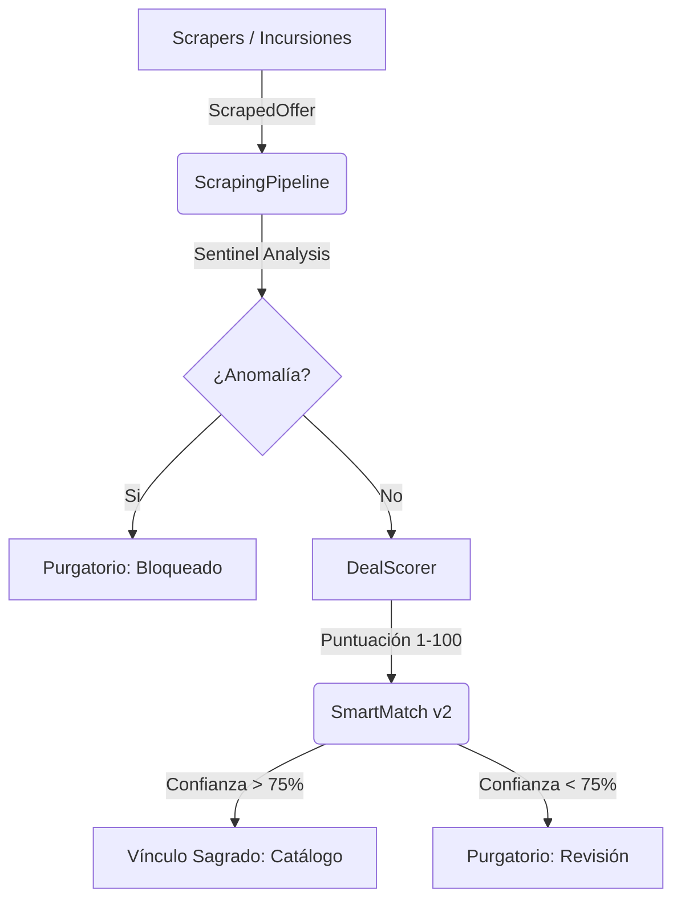

# 📜 EL CÓDICE DE ETERNIA: Sinergia Técnica

> [!IMPORTANT]
> **Esta es una guía de manifiesto y principios arquitectónicos.** Para entender el funcionamiento exacto de la aplicación, variables de entorno, y diagramas de flujo de datos actualizados, consulta la **[DOCUMENTACION MAESTRA](DOCUMENTACION_MAESTRA.md)**.

Este documento es una reliquia viva que describe la intersección de tecnologías, herramientas y procesos que dan vida a **Nueva Eternia**. A diferencia del Roadmap (visión) o el Log (historia), el Códice explica el **CÓMO** todo funciona en conjunto de manera incremental.

---

## 🏗️ El Ecosistema de Datos

El Oráculo procesa datos a través de una arquitectura de capas diseñada para la resiliencia:

### 🛠️ Herramientas de Infiltración (Tech Stack)

1. **Playwright Nexus**: El motor de infiltración avanzada que permite saltar protecciones de Amazon, BBTS y Wallapop (Bypass 403) mediante simulación humana y expansión dinámica del DOM.
2. **Sitemap Deep Scan (Eternia Shield)**: Estrategia de búsqueda de alta precisión para tiendas con motores internos mediocres (DVDStoreSpain), combinando descubrimiento XML con navegación directa.
3. **FastAPI Broker**: El puente entre la base de datos local (SQLite) y el estado global (Supabase).
4. **Vite + React 19**: Interfaz líquida que permite al Arquitecto tomar decisiones en milisegundos.

---

## ⚡ Procesos Críticos

### 1. La Vía del Purgatorio (Data Lifecycle)

Cada hallazgo debe pasar por el Purgatorio a menos que la confianza sea absoluta.

- **Ghost Sync**: El frontend guarda acciones localmente si la API no responde, asegurando que el Arquitecto nunca pierda su trabajo.
- **Auto-Clear**: El sistema limpia alias y mapeos fallidos para no repetir errores de vinculación pasados.

### 2. El Oráculo Logístico (Financial Truth)

No todos los precios son reales. El sistema calcula el **Landed Price**:

- `(Precio + Envío) * IVA + Tasas aduaneras`.
- Reglas específicas pre-cargadas para tiendas como **BigBadToyStore** (EE.UU.) y **Fantasia Personajes** (ES).

### 4. Flota de Incursión Sincronizada (Phase 50)

El sistema ahora garantiza la visibilidad total de las 13 fuentes de datos.

- **Auto-Discovery**: La API registra automáticamente cualquier nuevo scraper al inicio del servidor.
- **Orquestación Dual**: Ejecución coordinada entre GitHub Actions (Daily Scan) y disparadores manuales desde el Purgatorio.
- **Trazabilidad Total**: Cada incursión genera un `ScraperExecutionLog` detallado que incluye items procesados, nuevos hallazgos y errores de red.

---

## 🛡️ Protocolos de Resiliencia y Seguridad (3OX)

Nueva Eternia está blindada mediante estos pilares de seguridad:

### 1. Gestión de Secretos (Zero-Leak Policy)

- **Variables de Entorno**: Todas las claves (Supabase, API Key, Telegram) residen exclusivamente en archivos `.env` o secretos de GitHub.
- **No Fallbacks**: Prohibida la inclusión de valores por defecto o hardcoded en el código fuente (especialmente en `admin.ts`).
- **Ignore Rules**: El sistema ignora automáticamente archivos `.html`, `.png` y `.log` generados durante el diagnóstico para evitar filtraciones de datos scrapeados.

### 2. Blindaje Operativo

- **Detección Bot**: Mediante rotación de User-Agents y simulación humana interactiva (Modo Sirius A1).
- **Inconsistencia de Red**: Transacciones atómicas con ROLLBACK automático ante fallos de Supabase.
- **Corrupción Visual**: Validaciones de UTF-8 y blindaje Unicode para terminales Windows.
- **Ghost Sync**: Búfer local de acciones administrativas para resiliencia offline.

### 5. Incursión PrestaShop (Phase 54)

- **Pixelatoy Engine**: Optimizado para navegar por categorías de alta densidad y extraer metadatos mediante atributos `content` de PrestaShop, eludiendo la inestabilidad de términos de búsqueda genéricos.

### 6. El Legado y la Graduación ASTM/C (Phase 55)

El sistema ahora permite una valoración quirúrgica de la colección personal mediante el **Legado**:

- **Multiplicadores de Estado**: El Valor de Mercado se ajusta automáticamente según la condición (MOC, NEW, LOOSE).
- **Ajuste Fino (Grading)**: Un deslizador de 1-10 permite capturar el "Shelf Wear" (esquinas dobladas, burbuja amarillenta). Cada reducción de grado aplica un decremento logarítmico del 4% sobre la base de mercado.
- **ROI Dinámico**: El retorno de inversión se recalcula en tiempo real en el frontend mediante el `Advanced Valuation Engine` antes de persistir en el backend.

### 7. Blindaje de Conexión BD (Phase 56)

La resiliencia de las incursiones largas depende de la salud de la conexión a Supabase:

- **Pool Pre-Ping**: Cada query verifica que la conexión esté viva antes de ejecutarse. Si no, se crea una nueva automáticamente.
- **Pool Recycle (1800s)**: Las conexiones se reciclan cada 30 minutos, evitando que Supabase las cierre por inactividad durante incursiones de 3+ horas.
- **Timeout Global**: 30 minutos por incursión completa. Timeout individual de 5 min por scraper.

### 8. Cancelación Cooperativa de Scrapers (Phase 56)

El sistema de parada de incursiones ahora opera en dos capas:

- **Capa Software**: Un `threading.Event` global actúa como señal de cancelación. El `ScrapingPipeline` consulta este flag entre cada scraper. Si está activo, aborta limpiamente y devuelve las ofertas parciales.
- **Capa Hardware**: `psutil` mata procesos hijo de Playwright/Chromium como respaldo.
- **Ejecución Secuencial**: Los scrapers corren uno tras otro (no en paralelo), permitiendo cancelación precisa e individual timeouts de 5 min.

### 9. Renderizado y Táctica Visual (Phase 57)

El sistema ahora emplea una **Reserva Táctica de Loaders**:

- **Spinners Ligeros**: Interacciones cotidianas (modales, grids, botones) utilizan componentes ligeros (`RefreshCw` de `lucide-react`) para carga inmediata sin bloqueos de UI pesados.
- **PowerSwordLoader**: Reservado estrictamente para Navegación de Router y Sincronización de Identidad, maximizando la sensación premium sin penalizar la velocidad de TTI (Time To Interactive).
- **Search Escalable**: Input dinámico multilínea (`<textarea rows={2}>`) para evitar el truncado de strings complejas (ej. capturas de Wallapop o series numéricas combinadas) en dispositivos móviles.

### 10. Segregación Vintage y Flujo de Naming (Phase 60)

El sistema ahora garantiza el aislamiento absoluto entre las colecciones **Eternia (Vintage)** y **Origins (Nueva Eternia)**:

- **Aislamiento Base de Datos**: Las consultas a los catálogos y colecciones filtran mediante el parámetro `is_vintage` para mantener segregadas ambas líneas.
- **Pabellón Vintage**: Las ofertas recolectadas de scrapers vintage (Ebay, Vinted, Wallapop vintage) se gestionan por separado en el Pabellón.
- **Flujo de Naming Interactivo**: Al clasificar ofertas en el Purgatorio como vintage, un modal interactivo obliga a asociar el muñeco a un nombre vintage (existente o nuevo).
- **Sufijado Auto-Vintage**: Para evitar colisiones de nombres con la serie Origins, cualquier nuevo nombre ingresado se sufija automáticamente con " Vintage" de forma insensible a mayúsculas/minúsculas.

### 11. Santuario Público, Filtro de Deseos, Completitud de Waves y Arsenal Analytics (Fase 61 - Pareto)

El sistema incorpora características estratégicas de alto valor y bajo impacto para optimizar el coleccionismo:

- **Santuario Compartido (Showcase)**: Los usuarios pueden hacer pública su colección eliminando todos los datos financieros sensibles (`purchase_price` e inversión total) para proteger su privacidad, accesible en `/santuario/:username`.
- **Filtro Cruzado de Deseos**: Permite filtrar las ofertas activas en el Mercader de Eternos en base a las figuras en la Lista de Deseos en tiempo real.
- **Regimientos de Completitud (Waves)**: Panel visual en el Orbe de Grayskull que agrupa y calcula el porcentaje de figuras adquiridas frente al total disponible de cada sub-categoría (Origins, Deluxe, Vintage, etc.).
- **Arsenal Analytics (Estado de la Fortaleza)**: Un gráfico circular interactivo (Donut Chart) con Recharts en el Dashboard que detalla porcentajes por estado (MOC, New, Loose) y calcula el valor de mercado ponderado correspondiente.
- **Renovación Local SSL**: Script `renew_ssl.sh` para renovación local autónoma del certificado vía Docker Certbot, previniendo la exposición de claves privadas SSH a GitHub Actions.
- **Scraper Wallapop Híbrido**: Integración de llamadas directas a la API general de búsqueda mediante `curl_cffi` (impersonación de TLS de Chrome) con fallback a Playwright persistente ante bloqueos WAF.

---

### 12. Optimización Extrema de Renderizado (Fase 67)

El Oráculo maximiza la respuesta y fluidez de la interfaz mediante técnicas no invasivas:
- **Persistencia Lazy Keep-Alive**: Para evitar desensamblar el DOM en React al cambiar de pestaña, se usa una técnica híbrida en `App.tsx`. Los componentes se renderizan bajo demanda (Lazy) pero persisten montados usando la clase CSS `hidden` de Tailwind. Esto conserva el scroll y los estados cargados en memoria, acelerando el tiempo de respuesta visual a 0ms.
- **Limpieza de Sesión Activa**: Al cambiar de identidad de usuario o cerrar la sesión, el estado del keep-alive y sus cachés de datos se limpian por completo, evitando que se muestren datos residuales (fugas de información horizontal).
- **Sanitización del Ecosistema Operativo**:
  - *Inputs Vacíos de Inversión*: Inputs de importes financieros vacíos por defecto, forzando `0.0` solo en la persistencia del backend si se omiten. Valida expresiones regulares de puntos y comas indistintamente.
  - *Badges Visuales de Compra*: Visualización semántica (`ShoppingCart` en oro/cromo) en la Fortaleza para discernir las piezas donde se configuró un precio de adquisición personalizado, manteniendo el `--` limpio en las figuras que usan el promedio de mercado.

### 13. Caché Local de Imágenes y Fallback Híbrido (Fase 68)

El ecosistema cuenta con un sistema híbrido de caché y descarga local de imágenes para las figuras del catálogo:
- **FastAPI Static Mount**: Montura de la ruta `/api/static/images` apuntando a `data/image_cache/` en FastAPI.
- **Background Downloader**: Tareas asíncronas en segundo plano en `vault.py` para descargar imágenes de productos, rastreando el progreso (conteo total, descargados, errores) y soportando cancelación segura.
- **Componente React MOTUImage**: Reemplazo de etiquetas `` tradicionales por un componente con lógica de fallback. Intenta leer localmente si `use_local_images` está activo en localStorage. Si la carga falla (error 404/red), cambia instantáneamente al hotlink remoto original mediante el evento `onError` del navegador, garantizando consistencia visual absoluta y cero imágenes rotas.

### 14. Apertura Controlada de Ajustes y Excel Bridge Selectivo (Fase 69)

El panel de Configuración y sus opciones de sincronización operan ahora con visibilidad basada en roles:
- **Exposición Democrática del Sidebar**: Se abre el acceso a la sección de Configuración para usuarios no administradores (Guardianes) quitando la exclusión en `Sidebar.tsx`.
- **Excel Bridge Seguro (Role-Based)**: Restringida la visibilidad de la sección de sincronización local del Excel (`Excel Bridge`) a administradores/David (`isAdmin`), previniendo escrituras locales erróneas de usuarios externos.
- **Ajustes de Perfil Activos**: Los Guardianes mantienen el control de su configuración personal de Ubicación Geográfica, Santuario Público y Caché de Imágenes Local.

### 15. Compactación Estadística FinOps e Incursión Universal CDP (Fase 80)

Se ha implementado una arquitectura de optimización de espacio y captura universal asistida:
- **Modelo `ProductMonthlyStatsModel`**: Una tabla agregada que consolida el historial detallado de precios en promedios, medianas, percentiles 25/75 y desviación estándar mensuales, eliminando la necesidad de guardar URLs inactivas.
- **Servicio `MaintenanceService`**: Coordina las purgas inteligentes (eliminando ofertas de productos sin stock -previo borrado de su historial en `PriceHistoryModel` para evitar violaciones de clave foránea en bases de datos relacionales estrictas como Postgres- y reduciendo el historial a 60 días en activos) y la limpieza periódica de logs antiguos de scrapers y lista negra obsoleta.
- **Daily Scan & Mantenimiento a Demanda (Asincronía & Telegram)**: Integrado de forma automática al inicio de `daily_scan.py` y expuesto visualmente en la sección de Configuración (`Config.tsx`). El endpoint de mantenimiento se ejecuta asíncronamente en segundo plano a través de `BackgroundTasks` de FastAPI para eludir timeouts de red HTTP de Axios o proxies Nginx, y envía una notificación final detallada a David por Telegram con el desglose exacto de optimización. Adicionalmente, al finalizar el Daily Scan completo, se genera un reporte resumido en Telegram que detalla la duración, el total de ofertas procesadas, nuevas inyectadas, el total de ítems enviados al Purgatorio y los errores registrados.
- **Incursión Universal CDP**: Un motor de captura unificado (`scrape_multi_via_cdp.py`) y un script de PowerShell (`run_assisted_incursion.ps1`) para extraer ofertas directamente del navegador de depuración Chrome (puerto 9222) en Amazon, eBay, Smyths Toys y BBTS de forma sigilosa.

### 16. Nexo de Fusión Divina, Scroll Infinito y Optimización de Rendimiento Extremo (Fase 81)

Se ha implementado una arquitectura de optimización y consolidación de datos extrema para garantizar la fluidez de la app:
- **Consolidación en el Inventario**: El nexo permite realizar fusiones atómicas de productos temporales con definitivos. Al fusionar, el backend propaga y mantiene la coherencia del flag `is_vintage` en todas las ofertas transferidas y elimina el producto duplicado.
- **Paginación Dinámica y Scroll Infinito**: Los endpoints de la API aceptan `limit` y `offset`. En el frontend se utiliza `useInfiniteQuery` de React Query acoplado a un `IntersectionObserver` que detecta la cercanía al pie de página para desencadenar de forma progresiva y elegante la carga de lotes de 24 figuras.
- **Compresión Masiva y Code Splitting**: Conversión automatizada de todos los assets a WebP (ahorro del 94% en volumen de datos: 7.5 MB a 650 KB) e importación dinámica con `React.lazy` y `Suspense`, disminuyendo el JavaScript inicial de arranque a <200 KB.
- **Modo Rendimiento Adaptativo**: Permite silenciar los cálculos vectoriales 3D interactivos del mouse y los halos de iluminación reactiva sobre las tarjetas en móviles lentos al seleccionar efectos "Clásicos".
- **Activación del Radar**: El recálculo masivo e indexación de base de datos local y Supabase de 519 productos puebla el percentil 25 de 159 de ellos, proveyendo al Radar de Oportunidades de la telemetría histórica necesaria para su despliegue comercial.

*Última actualización: 19/07/2026 - Fase 81: Nexo de Fusión Divina, Scroll Infinito y Optimización de Rendimiento Extremo.*

