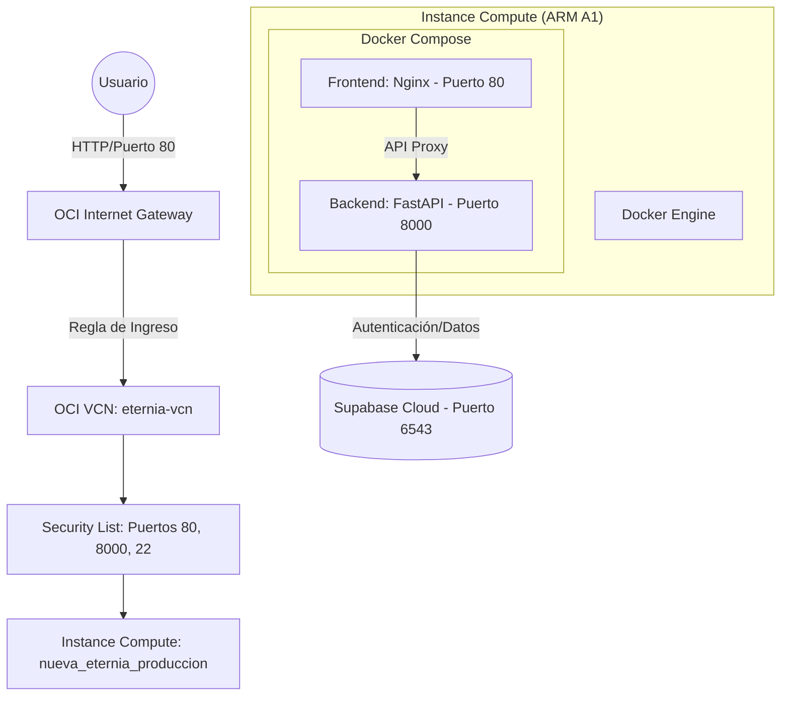

# Arquitectura Maestra 3OX: Guía de Despliegue en Oracle Cloud Infrastructure (OCI)

Este documento define la arquitectura maestra de despliegue para **El Oráculo de Nueva Eternia**, detallando la transición desde el entorno de desarrollo local hacia un entorno de nube de alta disponibilidad en Oracle Cloud Infrastructure (OCI).

---

## 🏗️ Mapa de Infraestructura (Visión 360°)

El siguiente diagrama ilustra el flujo de tráfico y el aislamiento de componentes diseñado para el ecosistema de Oracle Cloud:



### 🛰️ Shape Recomendado (OCI Always Free)
- **CPU**: Ampere A1 Compute (ARM Neoverse N1).
- **RAM**: 6 GB - 12 GB RAM (Configurable hasta 24 GB en Always Free).
- **Core**: 1 - 2 OCPUs.
- **Disco**: 50 GB - 100 GB Boot Volume (Paravirtualizado).

---

## 🚀 Guía "Zero-to-Hero": Despliegue Paso a Paso

### 1. Aprovisionamiento en OCI (Evaluar y Planificar)
1. **Red (Networking)**: 
   - Crear una **VCN** con una **Subred Pública**.
   - **Security List**: Añadir Reglas de Ingreso (Ingress Rules) para los puertos:
     - `80` (HTTP - Frontend)
     - `8000` (API - Gestión del Backend)
     - `22` (SSH - Administración)
2. **Instance Compute**:
   - Sistema Operativo: **Oracle Linux 9 (aarch64)**.
   - Asignar una IP Pública.
   - Guardar la **Llave Privada** (ej: `nueva-eternia-produccion.key`).

### 2. Preparación del Host (Ejecución)
Conectar vía SSH y actualizar el sistema:
```bash
ssh -i "ruta/a/la/llave" opc@<IP_PUBLICA>
sudo dnf update -y
sudo dnf install -y git docker
sudo systemctl enable --now docker
sudo usermod -aG docker opc
```

### 3. Despliegue y Persistencia (Ejecución)
Clonar el repositorio y configurar el entorno de producción:
```bash
git clone https://github.com/DavidLopezGarci4/oraculo-nueva-eternia.git
cd oraculo-nueva-eternia
```

Crear el archivo `.env.prod` con las credenciales de seguridad (Shield):
```bash
ENV=production
ORACULO_API_KEY=eternia-shield-2026
SUPABASE_DATABASE_URL=postgresql://postgres.<ID>:<PASS>@aws-1-eu-west-1.pooler.supabase.com:6543/postgres?sslmode=require
```

Lanzar el stack tecnológico:
```bash
sudo docker compose --env-file .env.prod -f docker-compose.prod.yml up -d --build
```

---

## � Flujo de Trabajo: Local vs Nube (Validación 360°)

Para garantizar la estabilidad del sistema, seguiremos un proceso de "Validación en Cascada":

1. **Desarrollo Local**: Realiza los cambios en tu PC. Pruébalos ejecutando la app localmente (usando SQLite si prefieres no tocar los datos de producción).
2. **Validación**: Verifica que las nuevas funcionalidades o correcciones funcionan como se espera en tu entorno controlado.
3. **Commit & Push**: Una vez validado, sube los cambios a tu repositorio de GitHub:
   ```powershell
   git add .
   git commit -m "Descripción del cambio"
   git push origin main
   ```
4. **Sincronización con OCI**: Los cambios ahora están en el "Cielo" (GitHub), listos para ser bajados al "Suelo" (Servidor OCI).

---

## 🛠️ Procedimiento de Actualización en la Nube

Cuando tengas cambios listos en GitHub y quieras verlos en `http://79.72.50.244`, sigue este ritual en tu ventana negra (PowerShell):

1. **Entra en el Servidor**:
   ```powershell
   ssh -i "ruta/a/la/llave" opc@79.72.50.244
   ```
2. **Descarga lo Nuevo**:
   ```bash
   cd oraculo-nueva-eternia
   git pull origin main
   ```
3. **Reconstruye y Reinicia**:
   Docker detectará qué ha cambiado y solo actualizará lo necesario.
   ```bash
   sudo docker compose --env-file .env.prod -f docker-compose.prod.yml up -d --build
   ```
   *Nota: El flag `--build` es vital para que Docker vuelva a "cocinar" el código nuevo.*

4. **Limpieza (Opcional)**: Si haces muchas actualizaciones, borra las imágenes viejas para no llenar el disco:
   ```bash
   sudo docker image prune -f
   ```

---

## 🌐 Gestión de Dominio y DNS (DuckDNS)

Para que el Oráculo sea accesible de forma segura y fácil de recordar:

1.  **Script de Actualización**: He creado `deploy/duckdns_update.sh`.
2.  **Automatización (Cron)**: En el servidor OCI, añade esta tarea para mantener la IP sincronizada:
    ```bash
    crontab -e
    # Añadir al final:
    */5 * * * * /bin/bash /home/opc/oraculo-nueva-eternia/deploy/duckdns_update.sh
    ```

## 🔐 Blindaje HTTPS (SSL)

El sistema ya está preparado para usar Certbot. Para generar el certificado por primera vez:

1.  Asegúrate de que el puerto 80 está abierto en OCI.
2.  Ejecuta (dentro de la carpeta del proyecto):
    ```bash
    docker run -it --rm --name certbot \
      -v "$(pwd)/certbot/conf:/etc/letsencrypt" \
      -v "$(pwd)/certbot/www:/var/www/certbot" \
      certbot/certbot certonly --webroot -w /var/www/certbot \
      -d oraculo-eternia.duckdns.org
    ```
3.  Reinicia Nginx: `docker compose restart frontend`.

## 👁️ Sistema "Ojo de Sauron" (Control de Acceso)

Ahora cada dispositivo (móvil o PC) que intente conectar será bloqueado inicialmente y recibirás una alerta en Telegram.

### Cómo autorizar un nuevo dispositivo:
1.  Intenta entrar a la app desde el nuevo dispositivo.
2.  Recibirás un mensaje en Telegram con el `ID de Dispositivo`.
3.  Como Administrador, puedes autorizarlo usando un comando API (o pronto desde el bot):
    ```bash
    curl -X POST "https://oraculo-eternia.duckdns.org/api/admin/devices/[ID]/authorize" \
         -H "X-API-Key: [TU_API_KEY]"
    ```
4.  ¡Listo! El dispositivo tendrá acceso permanente.

### 🔑 Variables de Entorno (.env.prod)
Asegúrate de que tu archivo `.env.prod` en el servidor contenga estas nuevas llaves para activar el Ojo de Sauron:
```env
# Seguridad y Notificaciones (Fase 6)
TELEGRAM_BOT_TOKEN=8017683246:AAFBJdNtD8X4TcPCpN_D5GawqI19uyoUaGY
TELEGRAM_CHAT_ID=7931331
ORACULO_API_KEY=eternia-shield-2026
```

---

## 📈 Roadmap Kaizen (Mejora Continua)

### 🌿 Nivel 1 (Inmediato): Estabilidad y Monitorización
- **Script de Health Check**: Implementar un cron job local que verifique el endpoint `/health` cada 5 minutos y reinicie el contenedor si falla.
- **Rotación de Logs**: Configurar el driver `json-file` de Docker para limitar el tamaño de los logs a 10MB y evitar el agotamiento del disco.

### 🛡️ Nivel 2 (Medio Plazo): Seguridad de Infraestructura
- [x] **Gestor de Certificados**: Integración de SSL con DuckDNS y Certbot (Completado).
- **Monitorización OCI**: Activar el OCI Agent para rastrear métricas de CPU/RAM y configurar alarmas.

---

## 🔐 Protocolos de Seguridad
- **Ojo de Sauron**: Control de acceso por dispositivo activado.
- **API Key**: La `ORACULO_API_KEY` debe coincidir entre el frontend y el backend.
- **SSL**: Todo el tráfico redirigido a HTTPS (Puerto 443).

---
**Versión**: 1.1.0-SHIELD | **Autor**: Antigravity (Arquitecto 3OX) | **Estado**: Validado
