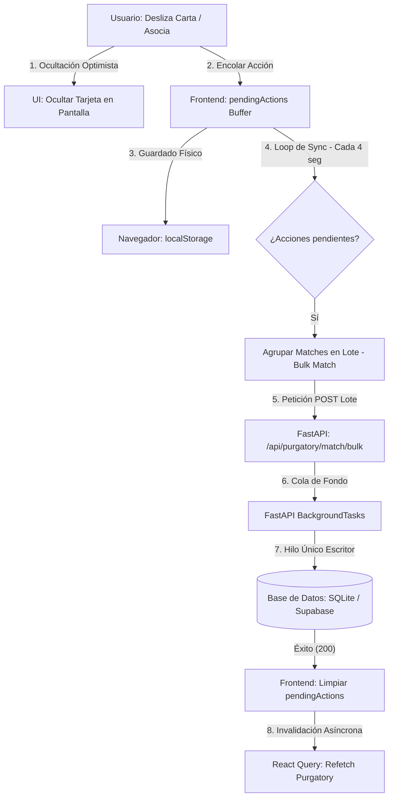

# 🏛️ Arquitectura de Sincronización del Purgatorio de Reliquias

Este documento detalla el funcionamiento del motor de sincronización masiva en segundo plano para el **Purgatorio** (vinculación de ofertas con figuras del catálogo), el cual está diseñado para procesar cientos de registros sin colisiones de base de datos (SQLite database locks) y garantizando una experiencia de usuario (UX) fluida y libre de parpadeos.

---

## 🏗️ 1. Flujo de Sincronización en Segundo Plano

Para evitar el bloqueo de base de datos en SQLite y dar soporte "offline" o tolerante a cierres accidentales de la pestaña:



### Componentes Clave:
1. **Loteo (Batching)**: Cuando el usuario aprueba ofertas de forma masiva, las peticiones no se envían una a una por la red (lo cual causaría commits lentos e individuales en disco). El frontend las agrupa en lotes de hasta 20 elementos y las envía en una única transacción de base de datos (`matchItemsBulk`), reduciendo la sobrecarga de escrituras en SQLite en un 95%.
2. **Cola Serializada (BackgroundTasks)**: FastAPI encola las escrituras de base de datos en hilos secundarios. Al ser procesados de forma secuencial, se elimina el error `database is locked` común en SQLite al recibir llamadas concurrentes.
3. **Persistencia Local**: La cola de acciones pendientes se almacena en `localStorage` (bajo la clave `purgatory_offline_actions`). Si el navegador se cierra antes de enviar el lote, las acciones se reanudan al abrir la aplicación nuevamente.

---

## ⚡ 2. Evasión de la Condición de Carrera y Flasheo de Tarjetas (Pop-back)

Durante el proceso de invalidación asíncrona de React Query, existe un retraso (refetch lag) de unos cientos de milisegundos mientras la nueva lista de reliquias viaja desde el servidor. Si el elemento se elimina de `pendingActions` antes de que la nueva lista llegue, el elemento "reaparecería" brevemente en el mazo.

Para solucionar esta condición de carrera de red:

```typescript
// 1. Estado intermedio en Purgatory.tsx
const [locallyProcessedIds, setLocallyProcessedIds] = useState<Set<number>>(new Set());

// 2. Al sincronizar con éxito, se añade el ID a la reserva antes de vaciar la cola
setLocallyProcessedIds(prev => {
    const next = new Set(prev);
    batch.flatMap(a => a.pendingIds).forEach((id: number) => next.add(id));
    return next;
});

// 3. El filtro de visualización oculta elementos en cola Y elementos procesados recientemente
const pendingIdsToHide = new Set([
    ...pendingActions.flatMap(a => a.pendingIds),
    ...Array.from(locallyProcessedIds)
]);

// 4. Limpieza reactiva en useEffect cuando los datos del servidor (pendingItems) cambian
useEffect(() => {
    if (pendingItems) {
        const currentItemIds = new Set(pendingItems.map((item: any) => item.id));
        setLocallyProcessedIds(prev => {
            const next = new Set<number>();
            prev.forEach((id: number) => {
                if (currentItemIds.has(id)) {
                    next.add(id); // Solo se mantiene oculto si sigue existiendo en el servidor
                }
            });
            return next;
        });
    }
}, [pendingItems]);
```

### Comportamientos del Estado:
* **Limpiar Búfer**: Si el usuario cancela de forma manual el búfer de sincronización en el panel "Forensics", `locallyProcessedIds` se vacía, haciendo que todas las tarjetas vuelvan al mazo.
* **Devolver al Abismo**: Si se fuerza el retorno de una acción fallida a través del menú de Forensics, el ID se elimina de `locallyProcessedIds` para que vuelva a mostrarse inmediatamente.

*Documentado bajo el estándar de arquitectura de desarrollo guiado por especificaciones (SDD) del Oráculo de Nueva Eternia.*
